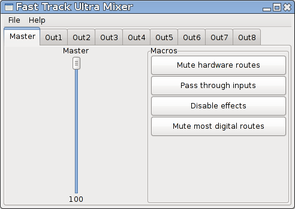
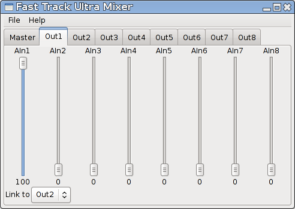

# Fast Track Ultra Mixer
A small mixer program for the M-Audio Fast Track Ultra audio interface on Linux.
It can be used as a graphical mixer program, like shown in the screenshots below.
Or it can be used as a command line program to restore certain settings automatically.

### License
Fast Track Ultra Mixer is licensed under the terms of the Apache License, version 2.
A copy of this license is in the LICENSE.txt file. If you did not receive a complete
copy of FTU-Mixer, you can read the license at [the website of the apache foundation](http://www.apache.org/licenses/LICENSE-2.0).

### Thanks
Very special thanks to Daniel Mack, Felix Homann, Aurelien Leblond, Takashi Iwai
and all the others who help to make Linux support multichannel USB audio interfaces.

## Requirements
As FTU-Mixer is a mixer for ALSA, it might be limited to Linux based operating
systems only.
It is written and tested with Python 3.8. Hopefully, other versions work as
well, but they have not been tested.
FTU-Mixer uses [wxPython](http://www.wxpython.org/) for the GUI and
[pyalsaaudio](http://pyalsaaudio.sourceforge.net/) as the wrapper for the ALSA
functionalities.

FTU-Mixer has been developed and tested with an ordinary (non 8R) M-Audio Fast
Track Ultra. The FTU-Mixer will also recognize, and work with, the Fast Track
Ultra 8R, but that combination has not been thoroughly tested.

## Known issues
FTU-Mixer does not react, when the volume of a route is changed by another program.
It uses select.poll to observe changes to the route's volumes, which does recognize
when something has happened. But when querying the new value for the route's volume,
it still gets the old/unchanged value.
This is probably due to a bug in pyalsaaudio, that has been reported [here](http://sourceforge.net/p/pyalsaaudio/bugs/9/)

Many of the channels seem to have a logarithmic mapping of the volume percentages,
that are set in FTU-Mixer, to the volume percentages in alsamixer. Because of this,
minor volume rections in FTU-Mixer cause massive attenuations of the affected channels.
Maybe, this is related to [this](https://github.com/larsimmisch/pyalsaaudio/issues/8) or
[this](https://github.com/larsimmisch/pyalsaaudio/issues/48) issue.

## The GUI
The GUI provides a simplified access to the mixer capabilities of the Fast Track
Ultra. It does not cover all features of the interface's internal mixer, but the
simplifications were made to be useful for most common use cases.
The GUI does not provide an access to the the Fast Track Ultra's built in effects
processor's parameters, other than a button to switch the effects off and the
routing of the digital signals (those that come out of the computer) is limited
to a master volume, that only controls the volume of the signals from a digital
input to the output with the same number. There is also a button to switch every
digital route off, that is not controlled by the master volume.
The hardware routing of the analog input signals is completely accessible through
the GUI.

If you need control over the effects processor, or you need to do more sophisticated
adjustments to the routing of the digital signals, rather than just a master volume,
you should use an alternative mixer like [Alsamixer](http://alsa.opensrc.org/Alsamixer)
or the mixer GUI from your preferred desktop environment.

### The master tab
The first tab in the GUI contains the slider for the master volume and some
"Macro"-buttons for special functions.

#### Adjusting the master volume
The master volume slider controls the volume from each digital input to the output
with the same number as the input. Other routes of digital signals are not affected
by this slider.
On startup, the slider will show the average value of the volumes of the digital
inputs. If the slider is moved, the volume of every affected route will be set
to the value of the slider.

This slider is meant to emulate the master control on other sound cards. Since
the routing of the digital signals can be used with JACK or other programs, the
other functionalities for the routing of digital signals are not covered by the
GUI. To mute all internal routing of digital signals, that is not controllable
with the master volume, there is the button "Mute most digital routes" in the
"Macros" box.

#### The "Macro" buttons
The "Macro" box contains some of buttons that make some common adjustments to
the routing. The functions behind the buttons are not really macros, as they are
not defineabble by the user, but I did not come up with a better name.

The functions are:
* **Mute hardware routes** mutes all routing of the analog input signals. This
    can be used, when all the routing shall be done by software. It can be useful
    to run this function on startup, to avoid feedback.
* **Pass through inputs** turns all routes from analog inputs to outputs with
    the same number to full volume. Other routes are not changed. This can be
    useful for certain monitoring setups, when the monitor mixes are not done
    with the Fast Track Ultra.
* **Disable effects** mutes all routes that are related to the Fast Track Ultra's
    built in effects processor. Since most people do not use the built in effects,
    this is the only GUI element, that controls the effects.
* **Mute most digital routes** mutes all routing for digital signals that are
    not affected by the master volume. These are the routes from a digital input
    to an output that has not the same number as the input. This function can be
    used to do all routing of signals from the computer with software routing
    programs like JACK.

### The hardware routing pages
There is one tab for each output in the GUI. These tabs contain volume sliders
for each analog input of the interface. This is like a mixer for each output.

#### Adjusting the volume
For each output, there is a tab with one slider for each analog input. Just use
the sliders like faders in a mixing console to create a mix for the selected
output.

#### Linking two outputs
It is possible to "link" two output tabs together. If a slider is moved in in a
tab, the slider in the linked output tab will move to the same value. The linking
functionality can be used to easily create mono mixes for stereo monitoring devices.

For example, you could link output *1* and *2*, if you are listening to the signal
being recorded through headphone out 1. Then you can adjust the monitoring mix
for *output1* and you will hear the mix with both ears and not only the one that
is listening to *output1*.

If you want to link an output to multiple other outputs, you can just daisy chain
them. For example, if changes in output1 shall affect both *output2* and *output3*,
you can link output1 to *output2* and *output2* to *output3*.
The links do not function in reverse. If *output1* is linked to *output2* and
*output2* is not linked to anything, then a slider for *output1* will affect the
corresponding slider for *output2*, but a slider for *output2* will not affect
any slider for *output1*.
It is possible to create circular links, like *output1* to *output2* and *output2*
to *output1*, without creating an infinite loop. This way, the loops will also
(sort of) function in reverse.

### The menu bar
The menu bar contains two menus. One is for loading or saving a config file and
the other one is to retrieve some information about FTU-Mixer.

## The config
The config can be used to save a state of the Fast Track Ultra's routing and loading
it again later. When a configuration is saved, it will contain the values of all
ALSA controls for the Fast Track Ultra and not only those, which can be accessed
through the GUI. Furthermore, it contains the information, which output tabs of
the GUI are linked.

When a configuration file is loaded, only those values are changed, that are contained
in the file. So if you want to create a config for a subset of the Fast Track Ultra's
controls, you can save the config to a file and then use a text editor to delete
the unnecessary lines.

## The command line parameters
FTU-Mixer can interpret a set of command line parameters to make it more versatile.
The parameters are:
* **-c** `CARD_INDEX` or **--card** `CARD_INDEX`
  You can specify the card index for the audio interface that shall be controlled.
  This way, FTU-Mixer can be used, if multiple Fast Track Ultras are connected
  to the computer.
* **-l** `CONFIG_FILE` or **--load-config** `CONFIG_FILE`
  You can specify a configuration file that shall be loaded on startup.
* **-X** or **--no-gui**
  You can prevent the mixer GUI from being shown. This could be used to load
  a routing configuration and then exit the program.
* **-F** or **--dont-disable-fx**
  By default, FTU-Mixer mutes all controls of the Fast Track Ultra's built in
  effects processor. This parameter can prevent that.
* **-M** or **--dont-mute-most-digital-outputs**
  By default, FTU-Mixer mutes all routes from a digital input to an output that
  has not the same number as the input. This parameter can prevent that.
* **-m** or **--mute-hardware-routes**
  This parameter can be used to mute all routes from analog inputs to the outputs.
  This can be useful, to avoid feedback.
* **-p** or **--pass-through-inputs**
  This parameter routes all analog inputs to the output with the same number.

